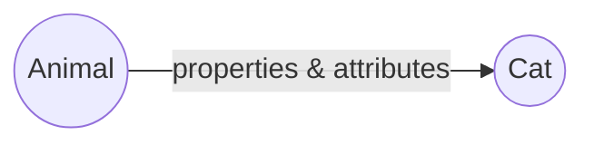
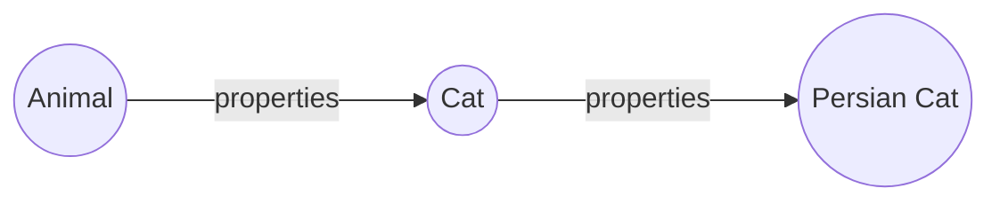
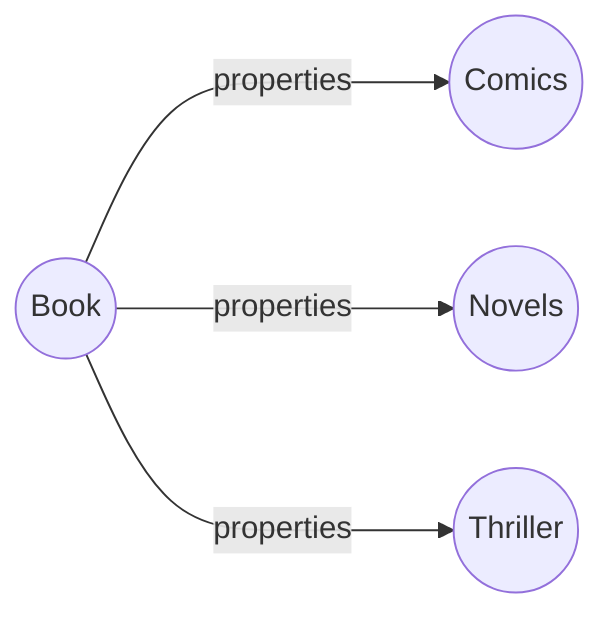

# OOP (Object-Oriented Programming) Fundamental
 Objects are simply referred as real world entities (paper, book, pen etc.) that we may use in our day-to-day lives. **Object-Orientated programming** is a procedure to design a program using couple of classes and objects. Some popular object-oriented languages are Java, C#, python, C++ etc.
 ## Advantages
 - Much faster in terms of development purpose & easier to execute.
 - Have clear structure to design a solution.
 - Modular & scalable, as it maintains DRY (Don't Repeat Yourself) principle.
 ## OOPs in Java
Java is known for its simplicity, reliability, and portability in the programming landscape for decades. Similarly, OOPs in java is to improve code readability and reusability by defining a java program efficiently. 
The main principles of object-oriented programming are *abstraction*, *encapsulation*, *polymorphism* and *inheritance*. Hence, some fundamental concepts of OOP:
 
 - Object
 - Class
 - Inheritance
 - Polymorphism
 - Abstraction
 - Encapsulation

### Objects & Classes
Any entity that has state and behavior is known as object. In short, an object can be defined as an instance of a class. Whenever an object is created, it contains some an address and takes up some space in memory. These objects can have their own behavior & attributes. 
 Everything in java is associated with objects and classes. For example:
 We can treat an animal as an object. An animal has a *name*, *color*, *temped* etc. as attributes, and *walking*, *sleeping*, *food* as behavior. 
 Let's assume, we have two classes named as **MyAnimal** and **Animal**, 
 ```java
class Animal{
	String name = "cat";
	String colour = "yellowish white";
	boolean temped = true;
}
class MyAnimal{
    public static void main(String args[])
    {
        Animal animal = new Animal();
        System.out.println(animal.name);
        System.out.println(animal.colour);     
    }
}
 ```
 In the above example, *animal* refers to a new object of Animal class. The name and the colour of the animal is returned by those print statement. So the output will be:
 ```java
 cat
 yelloowish white
 ```
 
  ### Inheritance
  
#### Single level

In this level of inheritance, the derived class inherits all the properties from its parent class. This type of inheritance ensures code reusability & addition of new features in the derived class. 

Let's see the example,
```java
class Animal{
	String name;
	boolean temped;
	public void walk(){
		System.out.println("Parent Animal is walking...!");
	}
}
class Cat extends Animal{
	Cat(String name, boolean temped)
	{
		this.name = name;
		this.temped = temped;
	}
	public void walk(){
		System.out.println(name + " is walking...!");		
	}
}
class MyAnimal{
	public static void main(String args[]){
		Cat cat = new Cat("Kitty", true);
		cat.walk();
	} 
}
```
The output of the above code is:
```
kitty is walking...!
```

#### Multilevel 
A class is derived from another class which is also derived from another different class, such type of inheritance is known as Multilevel inheritance. 


Here is an example;
```java
class  Movie {
	String  name;
	int  year;
	public  void  type() {
		System.out.println("Any type of Movie...!");
	}
} 
class  HorrorMovie  extends  Movie {
	public  void  watch() {
		System.out.println("Horror movie watching.");
	}
}	
class  SimpleHorrorMovie  extends  HorrorMovie {
	// inherits both "type & watch" method from the immediate parent "HorroMovie" class.
	public  void  type() {
		System.out.println("Simple Horror movie..!");
	}
}
class  MyMovie {
	public  static  void  main(String[] args) {
		SimpleHorrorMovie  s_HorrorMovie  =  new  SimpleHorrorMovie();
		s_HorrorMovie.type();
		s_HorrorMovie.watch();
	}
}
```
Here, the **SimpleHorrorMovie** class inherits all the attributes from its two parental classes. So the output of the code segment will be:
```
Simple Horror movie..!
Horror movie watching.
```

#### Hierarchical level
In such inheritance level, One parent class can have more than one child class. 

Here is an example:
```java
class  Book {
	String  title, author;
	public  void  genre() {
		System.out.println("Any type of Book..!");
	}
}
class  Comics  extends  Book {
	public  void  genre() {
		System.out.println("Funny Comic books...!");
	}
}
class  Novels  extends  Book {
	public  void  genre() {
		System.out.println("This is a Novel...!");
	}
}
class  MyBook {
	public  static  void  main(String[] args) {
		Comics  comic  =  new  Comics();
		Novels  novel  =  new  Novels();
		comic.genre();
		novel.genre();
	}
}
```

In the above code segment, **Comics** and **Novels** are the two derived classes of **Book** class. All the properties and attributes of *Book* class are inherited by those two classes. We can define their common properties by their own custom attributes. Thus the output will be:
```
Funny Comic books...!
This is a Novel...!
``` 

#### A complete example of inheritance
 Let's assume, we have a parent class named as **Animal**.  It has some attributes (name, colour) and behavior (eat, sleep), which are common for all animal. 
 ```java
 class  Animal{
	String  name;
	String  colour;
	public  void  sleep(){
		System.out.println("Parent Animal is Sleeping...!");
	}
	public  void  eat(){
		System.out.println("Parent Animal is eating...!");
	}
}
 ```
 Also, this **Animal** class has two child classes. One is **Cat** and another one is **Dog**. Both of these two classes have their own-defined attributes & properties, similar to any other animal. To obtain all the common characteristics of other animals, these two classes extend their parent **Animal** class.  
Therefore, our *Cat* class:
```java
class  Cat  extends  Animal{
	Cat(String  name, String  colour){
		this.name  =  name;
		this.colour  =  colour;
	}
	public  void  sleep(){
		System.out.println(colour  +  name  +  " is sleeping in floor...!");
	}
	public  void  eat(){
		System.out.println(colour  +  name  +  " is eating "+name+"Food...!");
	}
}
``` 
We have defined the colour and name of both of these animal by *[parameterized constructor](https://w...content-available-to-author-only...t.com/java-constructor)*. Additionally, the behavior & attributes for **Cat** and **Dog** classes has also been modified according to their own characteristics. 
Similarly the properties for **Dog** class:
```java
class  Dog  extends  Animal{
	Dog(String  name, String  colour)
	{
		this.name  =  name;
		this.colour  =  colour;
	}
	public  void  sleep(){
		System.out.println(colour  +  name  +  " is sleeping in floor...!");
	}
	public  void  eat(){
		System.out.println(colour  +  name  +  " is eating "+name+"Food...!");
	}
}
```
Hence, these two classes have been derived from their parent **Animal** class. We can get the properties by creating two different objects for the child classes. 
```java
class  MyAnimal{
public  static  void  main(String  args[])
{
	Cat  cat  =  new  Cat("Cat", "red");
	cat.sleep();
	cat.eat();
	
	Dog  dog  =  new  Dog("Dog", "Black");
	dog.sleep();
	dog.eat();
	}
}
```
And, here are the outputs:
```java
redCat is sleeping in floor...!
redCat is eating CatFood...!
BlackDog is sleeping in floor...!
BlackDog is eating DogFood...!
```


### Abstraction
Abstraction is a process which displays only the information needed and hides the unnecessary information. The main purpose of abstraction is data hiding, means selecting the only necessary information from a large amount of data. Thus abstraction reduces programming complexities & efforts.
 Abstraction can be achieved by two ways:
	 - Abstract class &
	 - Interface

  
**Abstraction through Abstract Class:** 

An abstract class is a type of class where one or more abstract methods are present. An abstract method is a method that has only method definition but no implementation. Basically, abstract methods are used when two or more classes have that same method but with different implementation in different ways. Abstract class may have regular methods, but it must have one or more abstract methods. 
Let's discuss about an example:
Suppose, we have an abstract **Person** class which is the parent class for both **Employee** and **Teacher** class. And the **Person** class has one abstract method named as **info()** and a regular method as **eat()**. Here, both of the derived classes need to provide their own different implementation for the **info()** method. Let's jump into the code segment:  
```java
abstract  class  Person {
	String  name;
	int  age;
	public  abstract  void  info();
	public  void  eat() {
		System.out.println("Regular person is eating...!");
	}
} 
class  Teacher  extends  Person {
	Teacher(String  name, int  age) {
		this.name  =  name;
		this.age  =  age;
	}
	@Override
	public  void  info() {
		System.out.println(name  +  " is a teacher");
	}
} 
class  Employee  extends  Person {
	Employee(String  name, int  age) {
		this.name  =  name;
		this.age  =  age;
	}
	@Override
	public  void  info() {
		System.out.println(name  +  " is an Employee");
	}
	public  void  eat() {
		System.out.println("Employee is eating...!");
	}
} 
class  MyPerson {
	public  static  void  main(String[] args) {
		Person  p1  =  new  Teacher("Rafiq", 23);
		Person  p2  =  new  Employee("Shams", 25);
		p1.info();
		p2.info();
		p2.eat();
	}
}
```
And the output will be:
```
Rafiq is a teacher
Shams is an Employee
Employee is eating...!
```
>**Note:** We can't creat any object for any **Abstract** class. For exmaple, if we want to create a new object for the **Person class**, then the Java compiler will through a compilation error
 ```
Person p = new Person();
p.info();


// Output:
error: Person is abstract; cannot be instantiated
Person p = new Person();
^
```


**Abstraction through Interface:**

An interface in Java is a specification of method prototypes where only the abstract methods are present. To create an object of this type we need to implement this interface and provide a body for all the abstract methods of the interface. The user who want to use the methods of the interface, he/she only knows the interface's methods, information about the implementation is completely hidden from the user and thus abstraction is achieved. Consider the following example:

```java
interface  SmartPhone {
	void  powerButton();
	void  messageButton();
	void  camera()
}
class  Samsung  implements  SmartPhone {
	@Override
	public  void  powerButton() {
		System.out.println("Power button pressed for swithcing on and off");
	}
	@Override
	public  void  messageButton() {
		System.out.println("Press Message button for sending a message.");
	}
	@Override
	public  void  camera() {
		System.out.println("Touch & hold the Camera icon for taking a picture.");
	}
}
class  Nokia  implements  SmartPhone {
	@Override
	public  void  powerButton() {
		System.out.println("Touch & hold Power button for swithcing on and off the phone");
	}
	@Override
	public  void  messageButton() {
		System.out.println("Press Message button for sending a voice message.");
	}
	@Override
	public  void  camera() {
		System.out.println("Focus your eye on the camera icon for taking a picture.");
	}
}
public  class  MyPerson {
	public  static  void  main(String[] args) {
		SmartPhone  phone1  =  new  Samsung();
		SmartPhone  phone2  =  new  Nokia();
		phone1.camera();
		phone2.camera();
		
		phone1.powerButton();
		phone2.powerButton();
	}
}
```
The output will be:
```
Touch & hold the Camera icon for taking a picture.
Focus your eye on the camera icon for taking a picture.
Power button pressed for swithcing on and off
Touch & hold Power button for swithcing on and off the phone
```
Here we can see that the internal functionality of *Samsung* and *Nokia* phone are completely different. The user only need to decide which phone he/she wants to buy. The basic actions of a smartphone are almost similar but the internal implementations can be different. Thus abstraction ensures **what** we can do instead of **how**  to do.


### Encapsulation
Encapsulation is one of the core concepts of OOP fundamental concepts. It is the process of binding the data together such that the whole data turns into a single unit. As a result, this kind of approach ensures the safety as it keeps the data safe from outside interference and misuse. In this process, the data can only be accessed by the current class's methods, which is known as data hiding. Thus encapsulation acts as a protective wrapper that prevents the code & data from being accessed by outsiders with the help of a well-defined interface. 
Encapsulation is achieved by making the class members as **private, protected, public** (by providing specific access to the data). To get and modify the values of the members, there are also some public getter and setter methods. Thus the class members become read-only or write-only with the help of encapsulation. 
Let's dive into an example:
Suppose, we want to make a cup of coffee. To make different types of coffee we need different types of ingredients. The overall cost will be changed according to the requirements of the coffee details. Let's say we only need the coffee type and how many orders of coffee the customer need. To set these value we have private setter methods (e.g. **setType()**, **setTotalCoffee()**, **setSugarAmount()**) and to get the coffee the customer needs to call the public method **makeCoffee()**. Thus he/she can get the coffee with the auto generated fixed price.
```java
class  Coffee {
	private  String  type;
	private  int  sugarAmount;
	private  int  coffeeOrdered;
	public  void  setType(String  type) {
		this.type  =  type;
	}
	public  void  setSugarAmount(int  sugarAmount) {
		this.sugarAmount  =  sugarAmount;
	}
	public  void  setTotalCoffee(int  totalCoffee) {
		this.coffeeOrdered  =  totalCoffee;
	} 
	public  int  getCost() {
		int  coffeeType;
		if (type  ==  "Black")  coffeeType  =  100;
		else  coffeeType  =  200;
		return  coffeeOrdered  *  coffeeType;
	}
public  void  makeCoffee() {
	int  total  =  getCost();
	System.out.println(coffeeOrdered+ " "+type+" Coffee with "+sugarAmount+" spoons of Sugar is ready with the cost of "+total);
	}
}
class  MyCoffee {
	public  static  void  main(String[] args) {
		Coffee  coffee  =  new  Coffee();
		coffee.setTotalCoffee(1);
		coffee.setSugarAmount(2);
		coffee.setType("Black");
		coffee.makeCoffee();

		coffee.setTotalCoffee(2);
		coffee.setSugarAmount(3);
		coffee.setType("Cold");
		coffee.makeCoffee();
	}
}
```
hence, the output of the above code segment:
```
1 Black Coffee with 2 spoons of Sugar is ready with the cost of 100
2 Cold Coffee with 3 spoons of Sugar is ready with the cost of 400
```


### Polymorphism

Polymorphism refers to one object may have multiple forms. In OOP, polymorphism occurs when we have many classes with same type of common attributes but with different characteristics. And these classes are related to each other by inheritance. 
```java
class Bird{
	public void wings(){
		System.out.println("All Birds have wings..!");
	}
	public void sound(){
		System.out.println("Birds sounds");
	}
}
class Crow extends Bird{
	@override
	public void sound(){
		System.out.println("Crow's sound")
	}
}
class Chicken extends Bird{
	@override
	public void sound(){
		System,out.println("Chicken's sound")
	}
}
```
From the above example, we can clearly see that **Crow** and **Chicken** are a bird and both of these animals have similar common action **sound()**, but the way of doing the same action is different.
 
There exists two types of polymorphism:
>	- Static / Compile-time polymorphism
>	- Dynamic / Runtime polymorphism

**Compile-time Polymorphism:**

Compiler-time polymorphism is also known as Static polymorphism. Compile-time polymorphism can be achieved through method overloading. If a class have multiple methods of same name but with different method signature, then it is known as method overloading. Such type of polymorphism increases the readability of the program. 
Method can be overloaded by two ways:
	- By changing the number of arguments
	- By changing the data type

Suppose, we want to perform the addition operation for the given any number of arguments. We can initialize the same **add()** method with different number of arguments.
```java
class Calculation{
	public void add(int a, int b){
		System.out.println(a  +  b);
	}
	public void add(int a, int b, int c) {
		System.out.println(a  +  b  +  c);	
	}
	public void add(int a, double b){
		System.out.println(a  +  b);
	} 
}
```

**Dynamic/Runtime polymorphism:**

Runtime polymorphism is also known as Dynamic binding, which is used to call an overridden method that can be resolved at the runtime. In other words, if a subclass provides a specific implementation of the method that has been declared by one of its parent class, it is known as method overriding. In this approach, the method name in the subclass must have the same name as parent class and also must be an IS-A relationship. 
To achieve such type of polymorphism, we have to invoke the child class's overridden properties by creating a reference object of the parent class at runtime, and it is referred as *Dynamic method dispatch*.
```java
class MobileBrand{
	public void brandName(){
		System.out.println("All Mobile Company");
	}
}
class Samsung extends MobileBrand{
	public void brandName(){
		System.out.println("Samsung Mobile Phone");
	}
}
class Nokia extends MobileBrand{
	public void brandName(){
		System.out.println("Nokia Mobile Phone");
	}
}
class MyPhone{
	public static void main(String args[]){
		MobileBrand m1 = new Samsung();
		MobileBrand m2 = new Nokia();

		m1.brandName();
		m2.brandName();
	}
}
```
> **NOTE:** We can not override a static method, as we need to invoke the static methods without creating any object of that class.

Even if, we can override the derived class's method at runtime, but we can not achieve this property to override the data variables of the class at runtime. Like:
```java
class Java{
	String concept = "Java";
	void study(){
		System.out.println("Learing " + concept);
	}
}
class OOP extends Java{
	String concept = "OOP";
	void study(){
		System.out.println("Learing " + concept);
	}
}
class Main{
	public static void main(String args[]){
		Java jv = new OOP();
		System.out.println(jv.concept);
		jv.study();
	}
}
```
And the output will be:
```
Java
Learning OOP
```


## Additional Section
**Do we use inheritance for only 'Code Reusability' purpose ?**

The process by which one class gets all the properties (except the *private* properties) and functionalities(methods) of another class is called inheritance. The aim of inheritance is to provide the reusability of code so that a class has to write only the unique features and rest of the common properties and functionalities can be extended from the base/parent class. In fact, it also saves a good amount of time and effort by providing serveral interconnections between multiple classes that have some similar functionalities. Hence, another primary purpose of inheritance can be the establishment of the relatioship between several similar type of classes. Thus it ensures the classes have a "is-a" relationship, not the "has-a" relationship. Also, we can provide the new implementation of some existing functionalities by method overriding, which is only possible with the help of inhertance. 


**Why do we need private variables?**

We use private access modifier by restricting the access of any unusual access from outside of the class. Making the class members private is a good practice in Java for the development purpose. We can achieve high level encapsulation ability with the help of **private** access modifier. 
Private members are well encapsulated in class and developers know that these variables can not be easily altered without the appropriate accessibility inside of the code. Private members are not meant to be altered with the help of outside programmers. The term "data hiding" refers to keep the internal data hidden from other classes rather than changing the values directly from outsiders.

**What is the necessity of getter & setter method ?**

To access the private properties of a class, we need to create some public medium of access. And those public medium can be defined as getter and setter methods. However let's focus some other usecases of these public methods:

1. Suppose, we want to add some additional security layer in our authentication system. So we have to setup the validation process in the setter method.
2. If we want to make a variable read-only, then we can only provide the getter method and omit the setter methods.
3. Debugging can also be helpful by setting up the getter & setter methods.


**Difference between Abstraction and Encapsulation.**

The prominent difference between abstraction and encapsulation holds at their own implementation level. Abstraction focuses on what must be done and Encapsulation means how it should be done. Let's discuss some major differences between these two terms:

*Data handling:*
	By the definition of Abstraction, we are only concerned about which type of data are essential to perform some specific task. But in encapsulation, data is used after binding some additional secure layer by using the access modifiers.
For example: If we want to open a Bank account on any bank, then the bank demands various types of data from their customer. Such as: Customer name, father's name, mother's name, address, date of birth, spouse's name, tax info, job info, insurance policy etc. Though we provide all these information but all of them are not associated for opening an account. Thus the Bank filters out the valid documents and store those documents in their internal system, which ensures the abstraction and encapsulation concept respectively.

*Data hiding:*  
Abstraction provides some abstract idea about the design level of any system, whereas encapsulation hides the internal working of any specific action or task.
For example: By using smartphone, we can perform various tasks like: sending a message, capturing an image, calling a person, listening to music etc. We can only see what these features can do. But we do not need to know the internal logic of how these actions are performed. Thus the internal architecture and design implementations are hidden from the user.

*Implementation:*
Abstraction can be achieved either by Abstract class or Interface, whereas encapsulation is implemented by using the access modifiers and also by using some public getter & setter methods to access those class members. 


**When do we use abstract class and when do we have to use Interface?**

An abstract class is a such type of class that has at least one or more abstract method and also can have some regular methods. On the other hand, an interface is a user defined type that is syntactically almost similar to a class. It has some collection of field constant and some abstract methods without the method definition.
Let's preview some use-case of these two terminologies:

*When to use Abstract class:*
1. If we need to provide some base level implementation of all the subclasses then abstract class is a good choice. For example: All types of birds have wings, but not all birds can fly.
2. If we want to use some non-public members in our class then abstract class is needed, as interface contains only public members.
3. Suppose, we need to add some additional features to any of the derived class, then abstract class is also suitable. Because if want to add that particular behavior in interface, then all the child classes that implements that interface will also get that attribute which sometimes may not be a good practice. 

Now a real-world use case scenery can be:
 ```java
 abstract class Fruit{
    abstract void fruitName();
    void seeds(){
        System.out.println("All fruit have its own unique seed.");
    }
}
class Mango extends Fruit{
    void fruitName(){
        System.out.println("This is a Mango!");
    }
}
class Blueberry extends Fruit{
    void fruitName(){
        System.out.println("It's a Blueberry!");
    }
    void colur(){
		System.out.println("Blueberry's colour is black.");
	}
}

class MyFruit {
    public static void main(String[] args) {
        Mango mango = new Mango();
        Blueberry blueberry = new Blueberry();
        
        mango.seeds();
        mango.fruitName();
        
        blueberry.seeds();
        blueberry.fruitName();
        blueberry.colour();
    }
}
 ```
Here, the default behavior is to have unique seeds for any types of fruits. We have also added an additional attribute for the **Blueberry** class which might be need to define in the parent **Fruit** class. Thus we can provide some default implementation and some additional attributes through abstract class and its derived classes. Hence, the output will be:
```
All fruit have its own unique seed.
This is a Mango!
All fruit have its own unique seed.
It's a Blueberry!
Blueberry's colour is black.
```


*When to use interface:*

1. The common functionality that we want to provide to a wide range of objects, we should use an interface. Basically, abstract classes are suitable where objects are closely related, whereas interface is best suited to provide some common functionality to unrelated classes. 
2. Interface should be used when we have a clear and concrete idea for designing a solution for any particular task.
3. In Java, multiple inheritance is not supported. But if we want to acquire this property then we must use an interface where one class can have different types of attributes from two or more different interfaces.
4. In most cases, interface is used for small functional parts, whereas for a huge functional units we should use abstract classes. But generally it depends how we are designing a solution for a system.

Let's dive into a proper example:
We can simply think about a **Duck**, which is simply an animal that has the wings to fly, like other birds. It can also swim just like a fish. 
```java
interface Bird{
    void fly();
}
interface Fish{
    void swim();
}
interface Animal{
    void sound();
}
class Duck implements Bird, Fish, Animal{
    public void fly(){
        System.out.println("Duck can fly.");
    }
    public void swim(){
        System.out.println("Duck can swim.");
    }
    public void sound(){
        System.out.println("Duck's sound is like quack-quack.");
    }
}
class MyDuck {
    public static void main(String[] args) {
       Duck duck = new Duck();
       duck.fly();
       duck.swim();
       duck.sound();
    };
}
```
Hence, the output will be:
```
Duck can fly.
Duck can swim.
Duck's sound is like quack-quack.
```

**What is Association, Aggregation, Composition. Explain the inter class-relationship between these terms with inheritance.**

Association is a relation between two different classes which establishes through their Objects. Association refers to the "has-a" relationship between those two classes. In a real-world, we see everything with some relationship between various types of objects. However, association can be classified of four types. Let's discuss these with appropriate example:


1. *One-to-one:*  To be a part of a country, every citizen their own identity number. Like: for Bangladeshi people we have our unique NID (National Identity card) card.
2. *One-to-many:* A student can take tution from multiple teacher.
3. *Many-to-one:* Many professor can be assigned to one particular department for teaching.
4. Many-to-many: Multiple users can have their multiple bank accounts on multiple different bank.


Association have two types of forms. 
> Aggregation

> Composition


Let's have a brief discussion on both of these terms:

**Aggregation:**

Aggregation in java is a form of "has-a" relationship between two classes. It can be defined as loosely coupled relationship between two or more classes, means the two classes are not completely dependent on each other. Although both classes are associated with each other, one can exist without the other independently. Some real world entity relationships can be:


Suppose, we have two class objects of a *Bank* and the *Bank employee*. We can model a relationship between these two object. Let's assume, Bank authority has decided to close all their activities and also close the Bank forever. Due to this action, the employees will not be affected that much as they can get any other job for their livelihood. Hence these two objects are not totally dependent on each other.
Another example can be a *Car* and a *Music player*. The can will start to move even if it has no music player in it. Also, the music player is not dependent on the car, as it can be used for another purpose as well. 

```java
import java.util.ArrayList;
import java.util.List;

class Music {
	private  String name;
	Music(String name) {
		this.name = name;
	}
	public  String getName() {
		return  this.name;
	}
}
class MusicPlayer {
	private  String brandName;
	private  List<Music> musicList;
	MusicPlayer(String brandName, List<Music> songs) {
		this.brandName = brandName;
		this.musicList = songs;
	}
	public  String getBrandName() {
		return brandName;
	}
	public  List<Music> getMusicList() {
		return musicList;
	}
}
class Car {
	private  String carModel;
	private  MusicPlayer musicPlayer;
	Car(String model, MusicPlayer musicPlayer) {
		this.carModel = model;
		this.musicPlayer = musicPlayer;
	}

	public  String getCarModel() {
		return  this.carModel;
	}
	public  List<Music> getAllMusic() {
		List<Music> songs = musicPlayer.getMusicList();
		for (Music song : songs) {
		System.out.println(musicPlayer.getBrandName() + " MusicPlayer has songs with name = " + song.getName() + " in "
			+ carModel + " Car.");
	}
	return songs;
	}
	public  void start() {
		System.out.println("Car has been started..!");
	}
}
class Main {
	public  static  void main(String args[]) {

	Music m1 = new Music("abc");
	Music m2 = new Music("xyz");

	List<Music> songs = new  ArrayList<Music>();
	songs.add(m1);
	songs.add(m2);

	MusicPlayer m_player = new MusicPlayer("Xiaomi", songs);
	Car car = new Car("Premio", m_player);
	car.getAllMusic();
	car.start();
	}
}
```
hence, the output will be:
```
Xiaomi MusicPlayer has songs with name = abc in Premio Car.
Xiaomi MusicPlayer has songs with name = xyz in Premio Car.
Car has been started..!
```

**Composition:**

Composition in association, is a form of relationship where the classes are tightly coupled, means the classes are highly dependent on each other. This type of association is referred as *belongs-to* or *is part-of* association. Here, the classes cannot exist independent of each other. If the *container* class which holds the objects of the *member* class is removed, it also means logically the smaller class cannot exist. Let's explore some examples:
Suppose, we have two objects, a *car* and a *car-engine*. We can build-up some relationship between these two objects. A car will never start to move without an engine. Also, a car-engine will remain useless if there exists no cars as well. Thus, the two objects are highly dependent on each other.
Another useful example can be: A *library* and *books*. A library has different types of books that are organized properly. The existence of library will be vanished if somehow all the books are destroyed for some reason, and vice-versa. The sample code for the library and book object is demonstrated below: 
```java
import java.util.ArrayList;
import java.util.List;
class Book {
	private  String name;
	private  String author;
	Book(String name, String author) {
		this.name = name;
		this.author = author;
	}
	public  String getName() {
		return  this.name;
	}
	public  String getAuthor() {
		return  this.author;
	}
}
class Library {
	private  String name;
	private  List<Book> books;
	Library(String name, List<Book> books) {
		this.name = name;
		this.books = books;
	}
	public  String getName() {
		return  this.name;
	}
	public  void getBooks() {
		List<Book> allBook;
		for (Book book : books) {
		System.out.println( "LibraryName = " + name + " has a bookname = " + book.getName() + " of author = "
			+ book.getAuthor());
		}
	}
}
public  class Main {
	public  static  void main(String args[]) {
		Book book1 = new Book("ABC", "Author1");
		Book book2 = new Book("XYZ", "Author2");

		List<Book> books = new  ArrayList<Book>();
		books.add(book1);
		books add(book2);

		Library library = new Library("BookStall", books);
		library.getBooks();
	}
}
```
So the output will be:
```
LibraryName = BookStall has a bookname = ABC of author = Author1
LibraryName = BookStall has a bookname = XYZ of author = Author2
```
However, understanding different types of association helps the developers to write code efficiently that closely related to the real-life problems. 
