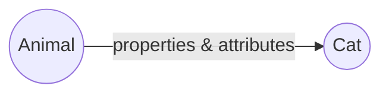
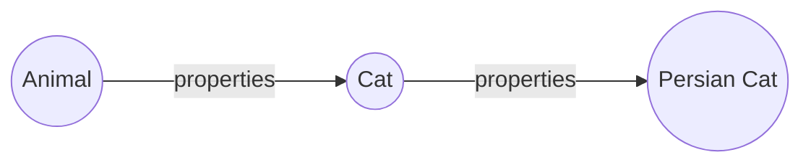
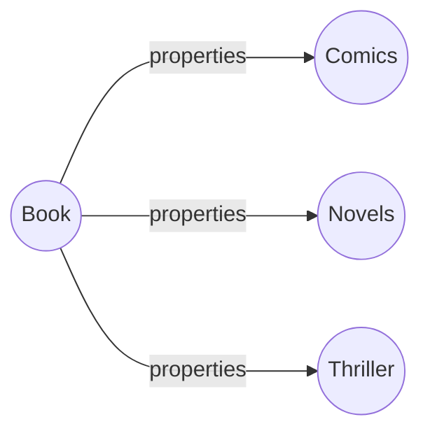

### Inheritance
  
#### Single level

In this level of inheritance, the derived class inherits all the properties from its parent class. This type of inheritance ensures code reusability & addition of new features in the derived class. 

Let's see the example,
```java
class Animal{
	String name;
	boolean temped;
	public void walk(){
		System.out.println("Parent Animal is walking...!");
	}
}
class Cat extends Animal{
	Cat(String name, boolean temped)
	{
		this.name = name;
		this.temped = temped;
	}
	public void walk(){
		System.out.println(name + " is walking...!");		
	}
}
class MyAnimal{
	public static void main(String args[]){
		Cat cat = new Cat("Kitty", true);
		cat.walk();
	} 
}
```
The output of the above code is:
```
kitty is walking...!
```

#### Multilevel 
A class is derived from another class which is also derived from another different class, such type of inheritance is known as Multilevel inheritance. 


Here is an example;
```java
class  Movie {
	String  name;
	int  year;
	public  void  type() {
		System.out.println("Any type of Movie...!");
	}
} 
class  HorrorMovie  extends  Movie {
	public  void  watch() {
		System.out.println("Horror movie watching.");
	}
}	
class  SimpleHorrorMovie  extends  HorrorMovie {
	// inherits both "type & watch" method from the immediate parent "HorroMovie" class.
	public  void  type() {
		System.out.println("Simple Horror movie..!");
	}
}
class  MyMovie {
	public  static  void  main(String[] args) {
		SimpleHorrorMovie  s_HorrorMovie  =  new  SimpleHorrorMovie();
		s_HorrorMovie.type();
		s_HorrorMovie.watch();
	}
}
```
Here, the **SimpleHorrorMovie** class inherits all the attributes from its two parental classes. So the output of the code segment will be:
```
Simple Horror movie..!
Horror movie watching.
```

#### Hierarchical level
In such inheritance level, One parent class can have more than one child class. 

Here is an example:
```java
class  Book {
	String  title, author;
	public  void  genre() {
		System.out.println("Any type of Book..!");
	}
}
class  Comics  extends  Book {
	public  void  genre() {
		System.out.println("Funny Comic books...!");
	}
}
class  Novels  extends  Book {
	public  void  genre() {
		System.out.println("This is a Novel...!");
	}
}
class  MyBook {
	public  static  void  main(String[] args) {
		Comics  comic  =  new  Comics();
		Novels  novel  =  new  Novels();
		comic.genre();
		novel.genre();
	}
}
```

In the above code segment, **Comics** and **Novels** are the two derived classes of **Book** class. All the properties and attributes of *Book* class are inherited by those two classes. We can define their common properties by their own custom attributes. Thus the output will be:
```
Funny Comic books...!
This is a Novel...!
``` 

#### A complete example of inheritance
 Let's assume, we have a parent class named as **Animal**.  It has some attributes (name, colour) and behavior (eat, sleep), which are common for all animal. 


 
 ```java
 class  Animal{
	String  name;
	String  colour;
	public  void  sleep(){
		System.out.println("Parent Animal is Sleeping...!");
	}
	public  void  eat(){
		System.out.println("Parent Animal is eating...!");
	}
}
 ```
 Also, this **Animal** class has two child classes. One is **Cat** and another one is **Dog**. Both of these two classes have their own-defined attributes & properties, similar to any other animal. To obtain all the common characteristics of other animals, these two classes extend their parent **Animal** class.  
Therefore, our *Cat* class:
```java
class  Cat  extends  Animal{
	Cat(String  name, String  colour){
		this.name  =  name;
		this.colour  =  colour;
	}
	public  void  sleep(){
		System.out.println(colour  +  name  +  " is sleeping in floor...!");
	}
	public  void  eat(){
		System.out.println(colour  +  name  +  " is eating "+name+"Food...!");
	}
	public  void  play(){
		System.out.println(colour  +  name  +  " loves to play with human!");
	}
}
``` 
We have defined the colour and name of both of these animal by *[parameterized constructor](https://w...content-available-to-author-only...t.com/java-constructor)*. Additionally, the behavior & attributes for **Cat** and **Dog** classes has also been modified according to their own characteristics. 
Similarly the properties for **Dog** class:
```java
class  Dog  extends  Animal{
	Dog(String  name, String  colour)
	{
		this.name  =  name;
		this.colour  =  colour;
	}
	public  void  sleep(){
		System.out.println(colour  +  name  +  " is sleeping in floor...!");
	}
	public  void  eat(){
		System.out.println(colour  +  name  +  " is eating "+name+"Food...!");
	}
	public  void  sound(){
		System.out.println(colour  +  name  +  " is barking...!");
	}
}
```
Hence, these two classes have been derived from their parent **Animal** class. We can get the properties by creating two different objects for the child classes. 
```java
class  MyAnimal{
public  static  void  main(String  args[])
{
	Cat  cat  =  new  Cat("Cat", "red");
	cat.sleep();
	cat.eat();
	
	Dog  dog  =  new  Dog("Dog", "Black");
	dog.sleep();
	dog.eat();
	}
}
```
And, here are the outputs:
```java
redCat is sleeping in floor...!
redCat is eating CatFood...!
BlackDog is sleeping in floor...!
BlackDog is eating DogFood...!
```
