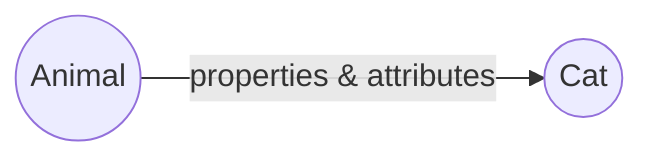
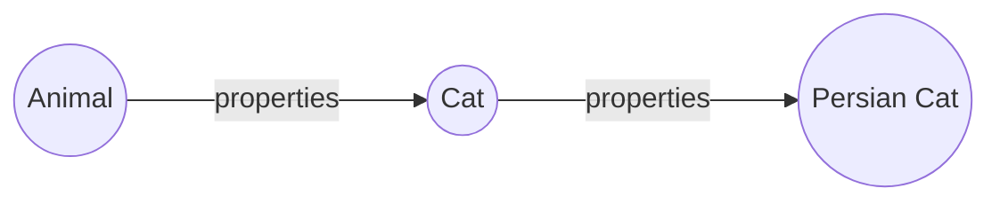
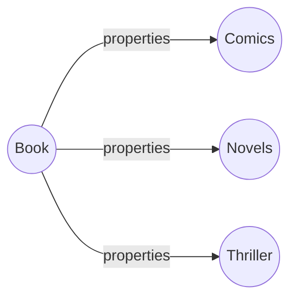

### Inheritance
  
#### Single level

In this level of inheritance, the derived class inherits all the properties from its parent class. This type of inheritance ensures code reusability & addition of new features in the derived class. 

Let's see the example,
```java
class Animal{
	String name;
	boolean temped;
	public void walk(){
		System.out.println("Parent Animal is walking...!");
	}
}
class Cat extends Animal{
	Cat(String name, boolean temped)
	{
		this.name = name;
		this.temped = temped;
	}
	public void walk(){
		System.out.println(name + " is walking...!");		
	}
}
class MyAnimal{
	public static void main(String args[]){
		Cat cat = new Cat("Kitty", true);
		cat.walk();
	} 
}
```
The output of the above code is:
```
kitty is walking...!
```

#### Multilevel 
A class is derived from another class which is also derived from another different class, such type of inheritance is known as Multilevel inheritance. 


Here is an example;
```java
class  Movie {
	String  name;
	int  year;
	public  void  type() {
		System.out.println("Any type of Movie...!");
	}
} 
class  HorrorMovie  extends  Movie {
	public  void  watch() {
		System.out.println("Horror movie watching.");
	}
}	
class  SimpleHorrorMovie  extends  HorrorMovie {
	// inherits both "type & watch" method from the immediate parent "HorroMovie" class.
	public  void  type() {
		System.out.println("Simple Horror movie..!");
	}
}
class  MyMovie {
	public  static  void  main(String[] args) {
		SimpleHorrorMovie  s_HorrorMovie  =  new  SimpleHorrorMovie();
		s_HorrorMovie.type();
		s_HorrorMovie.watch();
	}
}
```
Here, the **SimpleHorrorMovie** class inherits all the attributes from its two parental classes. So the output of the code segment will be:
```
Simple Horror movie..!
Horror movie watching.
```

#### Hierarchical level
In such inheritance level, One parent class can have more than one child class. 

Here is an example:
```java
class  Book {
	String  title, author;
	public  void  genre() {
		System.out.println("Any type of Book..!");
	}
}
class  Comics  extends  Book {
	public  void  genre() {
		System.out.println("Funny Comic books...!");
	}
}
class  Novels  extends  Book {
	public  void  genre() {
		System.out.println("This is a Novel...!");
	}
}
class  MyBook {
	public  static  void  main(String[] args) {
		Comics  comic  =  new  Comics();
		Novels  novel  =  new  Novels();
		comic.genre();
		novel.genre();
	}
}
```

In the above code segment, **Comics** and **Novels** are the two derived classes of **Book** class. All the properties and attributes of *Book* class are inherited by those two classes. We can define their common properties by their own custom attributes. Thus the output will be:
```
Funny Comic books...!
This is a Novel...!
``` 

#### A complete example of inheritance
 Let's assume, we have a parent class named as **Animal**.  It has some attributes (name, colour) and behavior (eat, sleep), which are common for all animal. 


 
 ```java
 class  Animal{
	String  name;
	String  colour;
	public  void  sleep(){
		System.out.println("Parent Animal is Sleeping...!");
	}
	public  void  eat(){
		System.out.println("Parent Animal is eating...!");
	}
}
 ```
 Also, this **Animal** class has two child classes. One is **Cat** and another one is **Dog**. Both of these two classes have their own-defined attributes & properties, similar to any other animal. To obtain all the common characteristics of other animals, these two classes extend their parent **Animal** class.  
Therefore, our *Cat* class:
```java
class  Cat  extends  Animal{
	Cat(String  name, String  colour){
		this.name  =  name;
		this.colour  =  colour;
	}
	public  void  sleep(){
		System.out.println(colour  +  name  +  " is sleeping in floor...!");
	}
	public  void  eat(){
		System.out.println(colour  +  name  +  " is eating "+name+"Food...!");
	}
	public  void  play(){
		System.out.println(colour  +  name  +  " loves to play with human!");
	}
}
``` 
We have defined the colour and name of both of these animal by *[parameterized constructor](https://w...content-available-to-author-only...t.com/java-constructor)*. Additionally, the behavior & attributes for **Cat** and **Dog** classes has also been modified according to their own characteristics. 
Similarly the properties for **Dog** class:
```java
class  Dog  extends  Animal{
	Dog(String  name, String  colour)
	{
		this.name  =  name;
		this.colour  =  colour;
	}
	public  void  sleep(){
		System.out.println(colour  +  name  +  " is sleeping in floor...!");
	}
	public  void  eat(){
		System.out.println(colour  +  name  +  " is eating "+name+"Food...!");
	}
	public  void  sound(){
		System.out.println(colour  +  name  +  " is barking...!");
	}
}
```
Hence, these two classes have been derived from their parent **Animal** class. We can get the properties by creating two different objects for the child classes. 
```java
class  MyAnimal{
public  static  void  main(String  args[])
{
	Cat  cat  =  new  Cat("Cat", "red");
	cat.sleep();
	cat.eat();
	
	Dog  dog  =  new  Dog("Dog", "Black");
	dog.sleep();
	dog.eat();
	}
}
```
And, here are the outputs:
```java
redCat is sleeping in floor...!
redCat is eating CatFood...!
BlackDog is sleeping in floor...!
BlackDog is eating DogFood...!
```


# Class Relationships


### Is-A Relation
When one class is a type of another class and can inherit the common attributes, that is know as **Is-A** relation. Another example can be: Cow is an Animal. But "An animal is a cow" can't be possible since all animals are not cow. So, from this we can understand that **Is-A** relation is unidirectional. We can represent Is-A relaton simply by an unidirectional arrow. Inheritance follows the is-a relationship.


### Has-A Relation
Let, **Class A** and **class B** have a "has-a" relationship if one or both need the other’s object to perform an operation, but both class objects can exist independently of each other. Example: **Student** has an **Address**. But, it is not neccesary that each address contains a student. So, here **Student** is the owner entity. Student class owns the Address Object. So, arrow will be towards the owner entity and arrow head will be a diamond shape.


### Part-Of Relation
Suppose, we have an **Mobile** and we need **Chip**,**Battery** and **Storage**. So, **Chip**,**Battery** and **Storage** are part of **Mobile**. So, the components will be only available when we have the **Mobile**. And also **Mobile** is dependent on the components. 


Have a look at this simple example in the following figure:


## Association
Association is a relation between two different classes which establishes through their Objects. Association refers to the "has-a" relationship between those two classes. However, association can be classified of four types. Let's discuss these with appropriate example:

1. *One-to-one:*  To be a part of a country, every citizen their own identity number. Like: for Bangladeshi people we have our unique NID (National Identity card) card.
2. *One-to-many:* A student can take tution from multiple teacher.
3. *Many-to-one:* Many professor can be assigned to one particular department for teaching.
4. Many-to-many: Multiple users can have their multiple bank accounts on multiple different bank.

The following figure describes the overview of the whole class relationship in Java:


Association have two types of forms. 
> Aggregation

> Composition


**Aggregation:**

Aggregation in java is a form of "has-a" relationship between two classes. It can be defined as loosely coupled relationship between two or more classes, means the two classes are not completely dependent on each other. Although both classes are associated with each other, one can exist without the other independently. Some real world entity relationships can be:


Suppose, we have two class objects of a *Bank* and the *Bank employee*. We can model a relationship between these two object. Let's assume, Bank authority has decided to close all their activities and also close the Bank forever. Due to this action, the employees will not be affected that much as they can get any other job for their livelihood. Hence these two objects are not totally dependent on each other.
Another example can be a *Car* and a *Music player*. The can will start to move even if it has no music player in it. Also, the music player is not dependent on the car, as it can be used for another purpose as well. 

```java
import java.util.ArrayList;
import java.util.List;

class Music {
	private  String name;
	Music(String name) {
		this.name = name;
	}
	public  String getName() {
		return  this.name;
	}
}
class MusicPlayer {
	private  String brandName;
	private  List<Music> musicList;
	MusicPlayer(String brandName, List<Music> songs) {
		this.brandName = brandName;
		this.musicList = songs;
	}
	public  String getBrandName() {
		return brandName;
	}
	public  List<Music> getMusicList() {
		return musicList;
	}
}
class Car {
	private  String carModel;
	private  MusicPlayer musicPlayer;
	Car(String model, MusicPlayer musicPlayer) {
		this.carModel = model;
		this.musicPlayer = musicPlayer;
	}

	public  String getCarModel() {
		return  this.carModel;
	}
	public  List<Music> getAllMusic() {
		List<Music> songs = musicPlayer.getMusicList();
		for (Music song : songs) {
		System.out.println(musicPlayer.getBrandName() + " MusicPlayer has songs with name = " + song.getName() + " in "
			+ carModel + " Car.");
	}
	return songs;
	}
	public  void start() {
		System.out.println("Car has been started..!");
	}
}
class Main {
	public  static  void main(String args[]) {

	Music m1 = new Music("abc");
	Music m2 = new Music("xyz");

	List<Music> songs = new  ArrayList<Music>();
	songs.add(m1);
	songs.add(m2);

	MusicPlayer m_player = new MusicPlayer("Xiaomi", songs);
	Car car = new Car("Premio", m_player);
	car.getAllMusic();
	car.start();
	}
}
```
hence, the output will be:
```
Xiaomi MusicPlayer has songs with name = abc in Premio Car.
Xiaomi MusicPlayer has songs with name = xyz in Premio Car.
Car has been started..!
```


